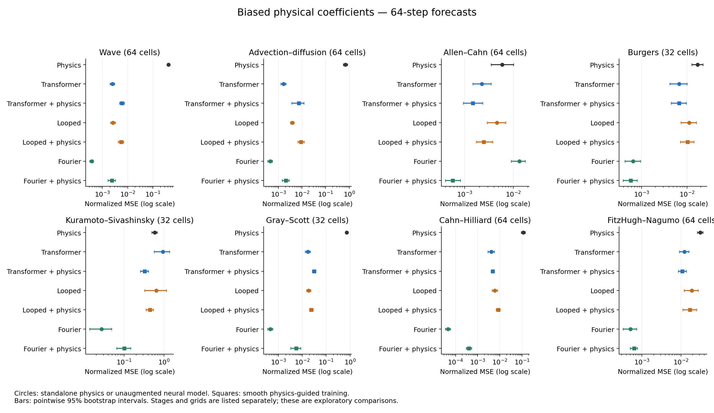
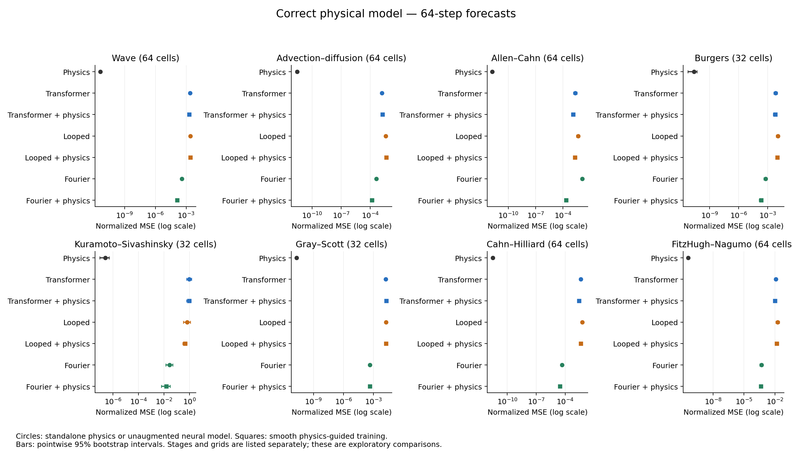
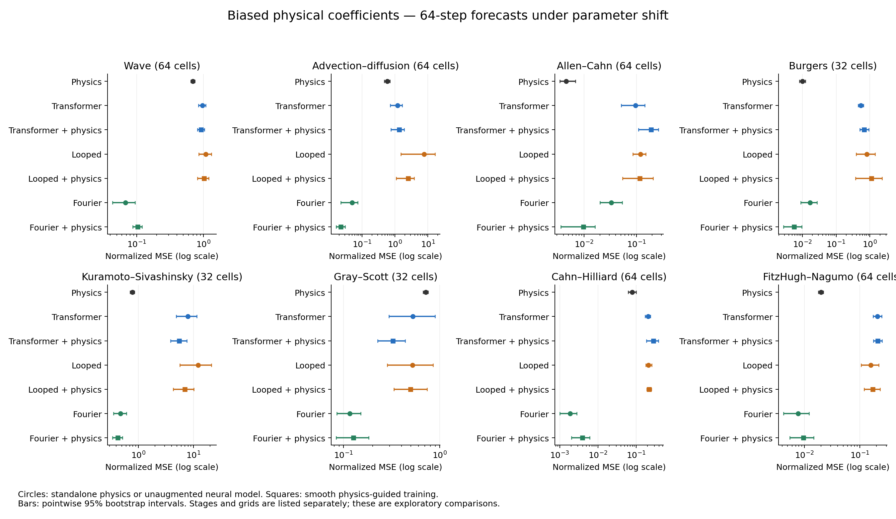
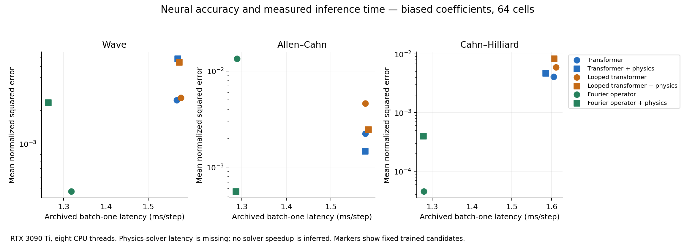

# Direct model comparison: archived evidence and audit

Prepared for Michael Doane, 12 September 2026. Reanalysis of the existing 1,584 neural fits and their cached physics baselines. No neural models were trained, and no RunPod job was started for this audit.

## Assessment

The direct accuracy comparison is recoverable and adds useful scientific context. The saved arrays support comparisons between the implemented standalone physical solver, a standard transformer, a looped transformer, a Fourier neural operator, and each neural model trained with physical supervision. They also support a direct comparison of neural training cost and inference latency. A separate physics-solver latency measurement was never recorded, so the complete physics-versus-neural accuracy–cost comparison remains unfinished.

The broader analysis is worth adding to the paper. It makes the practical choice clearer: an accurate physical solver is exceptionally strong on these synthetic systems; errors in its coefficients can make a learned predictor much more accurate; physical guidance can then help or harm that learned predictor. The preferred choice also changes under parameter shift. The controlled augmentation experiments explain part of this variation and remain the paper’s main experimental contribution.

The standalone physics results deserve explicit reporting. Their very small correct-model errors show that the numerical baseline solves these particular generated tasks accurately. This comparison also makes the setting’s limitations visible: the observations and the physical baseline use the same equation and solver family, the full state is available, and the correct physical parameters are supplied.

| Evidence component | Audit result |
| --- | --- |
| Archived neural fits | PASS — 1,584/1,584 records; saved evaluation hashes and protocol signatures verified |
| Direct accuracy | AVAILABLE — same trajectory identities, horizons, and state normalization |
| Physics references | PASS — 30 unique caches; 6,336 embedded reference arrays match those caches |
| 64-step numerical scoring | PASS — zero nonfinite values or active error caps in neural and physical comparisons |
| Neural computation | AVAILABLE — training/validation durations and synchronized batch-one inference timings |
| Standalone physics inference time | MISSING — mixed evaluation durations cannot supply this measurement |
| Scientific status | EXPLORATORY — post hoc comparisons with pointwise uncertainty intervals |
| New neural training | NONE |

## What was actually compared

The three neural architectures are separately trained forecasters. Physical guidance changes their training objective by adding targets produced by an approximate physical operator. Inference still runs the trained neural predictor alone. The standalone physics baseline advances its own predicted state with that physical operator. These are four predictor types with additional neural training variants. A separate latent-state world-model architecture is absent from the completed experiment.

For each trajectory, the saved error is the squared forecast error divided by the training standard deviation squared, averaged over state channels and spatial cells. This audit averages those errors over the first 64 or 96 forecast steps, the 64 test trajectories, and the training seeds. These are absolute normalized mean squared errors, abbreviated NMSE here. They can be compared directly within an equation and test condition. Channel-averaged error arrays cannot recover separate physical-unit errors for multichannel systems. Averaging NMSE across unrelated equations would require an explicit weighting choice; the principal tables keep equations separate.

The tables use the 64-cell follow-up for waves, advection–diffusion, Allen–Cahn, Cahn–Hilliard, and FitzHugh–Nagumo. Burgers, Kuramoto–Sivashinsky, and Gray–Scott use the 32-cell development runs. This is one explicit presentation choice per equation, with no choice based on which result looks strongest. The CSV files contain all four stages, both test distributions, both horizons, and every augmentation arm.

The primary checkpoint is the checkpoint chosen using validation error. Files named test_exact_mse or ood_exact_mse contain predictions from the final training update; “exact” in those names refers to the training step. This audit uses test_mse and ood_mse throughout.

## Direct accuracy with biased physical coefficients

Every entry below is mean NMSE over 64 forecast steps under the in-distribution test parameters. Lower values indicate greater accuracy. “Guided Fourier” uses smooth physics-generated training examples. Other guidance arms and all transformer guidance variants appear in the complete tables and the comparison explorer.

| Equation (cells) | Physics | Transformer | Looped | Fourier | Guided Fourier |
| --- | --- | --- | --- | --- | --- |
| Wave (64) | 0.414 | 0.00248 | 0.00261 | 0.000373 | 0.00237 |
| Advection–diffusion (64) | 0.684 | 0.00163 | 0.00386 | 0.000446 | 0.00205 |
| Allen–Cahn (64) | 0.00589 | 0.00224 | 0.00459 | 0.0135 | 0.000561 |
| Burgers (32) | 0.0171 | 0.00664 | 0.011 | 0.000651 | 0.000571 |
| Kuramoto–Sivashinsky (32) | 0.586 | 0.942 | 0.642 | 0.027 | 0.101 |
| Gray–Scott (32) | 0.734 | 0.0168 | 0.0183 | 0.000443 | 0.00544 |
| Cahn–Hilliard (64) | 0.114 | 0.00408 | 0.00594 | 4.57e-05 | 0.000403 |
| FitzHugh–Nagumo (64) | 0.0314 | 0.0123 | 0.019 | 0.000507 | 0.00063 |

With biased coefficients, at least one of these fixed neural choices has lower mean error than the physical solver for every displayed equation. The unaugmented Fourier model has the lowest mean error among the three unaugmented architectures in seven of eight displayed equations. Allen–Cahn is the exception: the unaugmented ordinary transformer is more accurate there. These are rankings of the implemented model configurations and training budget. The architectures have different parameter counts and represent spatial interactions differently.

## Correct physics is a strong reference

Across every correct-physics setting in the archive, the standalone solver has lower mean 64-step error than every tested neural configuration, both in distribution and under the recorded parameter shift. In the eight displayed in-distribution settings, solver NMSE ranges from about 1.75 × 10⁻¹² to 2.45 × 10⁻⁷. The largest value occurs in Kuramoto–Sivashinsky. The smaller errors in the other systems largely reflect an already accurate finite-grid numerical transition and floating-point effects.

This result supports including a standalone solver in the paper’s main comparison. It also limits the interpretation of neural forecasting gains: the added physical training examples improve some neural models within a benchmark where correct direct numerical evolution is already extremely accurate. No claim that a neural model is a more accurate replacement for the correct solver follows from these experiments.

## A useful crossover: Allen–Cahn

Allen–Cahn with biased coefficients gives a particularly clear example of why direct comparisons matter. At 64 cells and the 64-step in-distribution horizon, the unaugmented Fourier model has NMSE 0.0135 and the physical solver has NMSE 0.00589. The guided Fourier model has NMSE 0.000561. The same imperfect physical operator that is a middling standalone predictor supplies training information that helps the neural model surpass both alternatives.

The guided Fourier error is 90.5% lower than the biased solver’s error. The exploratory paired 95% interval for that reduction is 82.1–94.9%. The unaugmented Fourier error is 2.28 times the biased solver’s error, with a ratio interval of 1.30–4.09. These new contrasts use the ratio of arithmetic mean errors. The main manuscript’s augmentation percentages use a geometric average of paired error ratios, so the percentages need not be identical.

| Test distribution | Steps | Biased physics | Fourier | Guided Fourier |
| --- | --- | --- | --- | --- |
| In distribution | 64 | 0.00589 | 0.0135 | 0.000561 |
| In distribution | 96 | 0.0062 | 0.0301 | 0.00105 |
| Shifted parameters | 64 | 0.00454 | 0.0328 | 0.00963 |
| Shifted parameters | 96 | 0.00428 | 0.0788 | 0.019 |

The parameter-shift results change the recommendation. At 64 steps, biased physics has lower point-estimate error than the guided Fourier model, and their paired interval includes either ordering. At 96 steps, guided Fourier error is 4.45 times the biased solver’s error, with an exploratory ratio interval of 1.61–8.25. This longer-horizon comparison has no active error cap in either model. The in-distribution gain therefore has a concrete limit under the tested parameter shift.

## What the existing timing records establish

The recorded training stack used an NVIDIA RTX 3090 Ti, eight CPU threads, Python 3.12.3, and PyTorch 2.8.0 with CUDA 12.8. The following table pools the 60 fits per architecture/arm from the five 64-cell follow-up equations and their tested prior settings. Training time includes validation and the implementation’s associated execution work. The fixed-choice route adds recorded setup and, for augmented candidates, the implemented shared augmentation-bank construction.

| Configured model | Mean training/validation (s) | Mean fixed-choice route (s) | Median inference (ms/step) |
| --- | --- | --- | --- |
| Transformer | 43.32 | 43.36 | 1.582 |
| Transformer + guidance | 73.75 | 77.10 | 1.578 |
| Looped transformer | 39.64 | 39.68 | 1.583 |
| Looped transformer + guidance | 70.21 | 73.55 | 1.583 |
| Fourier operator | 25.25 | 25.29 | 1.268 |
| Fourier operator + guidance | 42.70 | 46.04 | 1.266 |

The Fourier implementation is faster in both training and batch-one inference for these configurations. The looped transformer uses roughly one third of the ordinary transformer’s parameters and applies a block three times during each forecast. Its inference latency is essentially the same in these measurements. Fewer stored weights therefore provide a memory advantage here; the timing records show little corresponding change in per-step latency.

Physical guidance raises training cost. The forward computation at deployment has the same layers and operations as the corresponding unaugmented neural model. Its recorded inference latency is consequently very similar. That is useful application context: information from a physical model can be incorporated during training without executing that physical model for each deployed forecast.

The archived latency measurement uses one resident input trajectory, five warmup forwards, and a synchronized block of 20 timed forwards. It excludes host-to-device transfer and recursive rollout bookkeeping. The fixed-choice costs exclude common simulation-data generation, common evaluation, earlier model search, and any solver calibration. The setup timers omit some work outside their measured regions. These numbers describe the implemented routes and benchmark scope; they do not give a complete application’s end-to-end cost.

The physics cache metadata contain a hash and a signature. The evaluate function times loading or generating cached references, best-checkpoint rollouts, final-update rollouts, and neural latency together. Dividing that total by a step count would produce an invalid standalone solver latency. No physics latency, speedup, or break-even forecast count is inferred from it.

## Model selection that can be examined now

The completed guarded selector chooses a training procedure within a fixed architecture. It does not choose the architecture or the standalone solver. This audit additionally examines two simple retrospective rules: choose the unaugmented architecture with the lowest archived validation loss, or choose the architecture and augmentation arm with the lowest archived validation loss. Each rule uses the existing best-validation record; test errors enter only after the choice is made.

For the 64-cell Allen–Cahn runs, validation selects the ordinary transformer among unaugmented models in every seed. When the augmentation choices are added, it selects the guided Fourier model in every seed, under both correct and biased physics. For the 64-cell biased wave and transport runs, it selects unaugmented Fourier in every seed. These choices reproduce the useful distinctions seen in the direct test comparisons without selecting a model using its test error.

The retrospective rules require all candidate fits. At 64 cells the three-architecture unaugmented search costs about 108 recorded seconds per equation–prior–seed case. Searching the six candidates in the resolution stage costs about 296–300 seconds; the twelve-candidate selector-stage search costs about 671–673 seconds. Those costs exceed the cost of training one known choice. The rules were specified after the study and have no new independent confirmation. The archive has no standalone physics validation-rollout score, which prevents adding the physics solver to this particular selector using saved validation records alone.

## Audit details and limits

The release verifier passed 17,809 integrity checks, including source/protocol consistency and links between development and follow-up records. The 108 archived target selector decisions were replayed, and the existing small ridge fit was reconstructed solely as a reproducibility check. No neural optimization was performed. The direct-comparison script independently checked every evaluation hash, expected candidate identity, completed training step count, trajectory pairing, cached physical reference, and state normalization.

The physical rollout calls the numerical step function directly and feeds each predicted state into the next step. Neural weights are unused in that path. Approximate coefficients are constructed once in data preparation; the step function applies the structural omission when requested and performs no second coefficient multiplication. Both physical and neural errors use the same reference trajectories and training-derived state scales.

The 64-step comparisons are finite and unaffected by either stage’s protective error cap. At 96 steps, caps affect 7 in-distribution and 83 shifted-distribution neural candidate–trajectory combinations across the archive; the raw arrays remain finite. The affected cases are retained with the original stage’s scoring rule and are listed in numerical_diagnostics.csv. Physical baselines have no affected cases at either horizon. The main 64-step conclusions therefore do not depend on cap conventions.

Uncertainty intervals use 5,000 crossed bootstrap replicates. Training seeds and complete test trajectories are resampled, with shared draws for compared candidates. The deterministic physics reference is resampled by trajectory once; its copies in different neural run files are never counted as additional independent observations. Intervals are conditional on the fixed training datasets and equations. They are exploratory pointwise 95% intervals, with no multiplicity adjustment, new acceptance threshold, or claim of prospective confirmation.

The biased physical baseline uses the supplied imperfect coefficients throughout its rollout. The neural models learn from trajectories generated by the correct system. No data-calibrated physical solver was fitted as a comparator. A learned model beating this fixed biased solver establishes that observed trajectories can compensate for the specified model error; it leaves open what coefficient calibration or equation correction would accomplish with the same data.

The coefficient experiment also fits parameter normalization separately by prior regime. Positive constant coefficient rescaling cancels in the standardized neural inputs, to numerical precision. Its direct effect is on the physical operator used for guidance and the standalone solver. These experiments do not represent every form of uncertainty about physical parameters.

The study tests particular coefficient multipliers and omitted terms, one training-data draw per equation/grid, compact periodic one-dimensional fields, fully observed states, and known forcing. It supplies examples of when the preferred choice changes. It cannot locate a general threshold of physical-model error, data quantity, or forecast horizon at which every new application should switch methods.

## Implications for the manuscript

Recommendation: add the standalone physics baseline and an explicit model-choice results subsection. Keep the controlled physical-supervision comparisons and the frozen selection experiment as the detailed investigations. This would make the paper easier to understand and more relevant to a reader deciding what kind of forecaster to build. The original abstract’s focus on additional examples understates that practical motivation.

The most useful expanded story is conditional choice. Correct physics works extremely well in this setting. Learned models can compensate for substantial errors in a fixed physical prior. Combining physical supervision with a learned model can further improve accuracy, and the benefit depends on both architecture and test conditions. The Allen–Cahn crossover gives this story a concrete example. This audit supplies evidence for that framing using existing runs.

The direct baseline comparison adds context and strengthens the paper’s completeness. Its novelty as a standalone finding is modest: a correct solver outperforming a compact learned approximation on its own generated system is expected. The interesting additional evidence is the measured ordering among biased physics, individual neural architectures, their guided variants, and the changes under parameter shift. A universal selector and a complete accuracy–cost recommendation remain open questions.

The manuscript files have been preserved during this audit. The results here are available for deciding whether and how to broaden the paper.

## Reproduction and the remaining timing measurement

The package contains the Python reanalysis, per-trajectory sufficient statistics, source hashes, numerical diagnostics, every direct contrast, and the report figures. The original evaluation arrays and source are in release 1.0.0: https://doi.org/10.5281/zenodo.22728288. Repository: https://github.com/MRDOANE/physics-guided-learning.

Run audit_model_choice.py with --repository pointing to the extracted release. NumPy and Matplotlib are sufficient; the reanalysis imports no training code. It writes the checked records, tables, figures, and a console summary. build_audit_report.py rebuilds this report from the resulting tables. README.md gives the exact commands and file descriptions.

An optional script, benchmark_inference_no_training.py, times the physics solver and all three neural forward computations on the same machine. It performs no fitting. The public release excludes trained checkpoints, so its neural weights are initialized only to execute the fixed architecture. Fresh results must be labeled architecture execution benchmarks and compared with each other; historical trained-model accuracy remains a separate measurement. The script has been syntax checked and reviewed against the archived interfaces. It has not been executed here because this analysis environment has no PyTorch/GPU runtime.

The timing script addresses the missing implementation measurement. A deployment-grade solver comparison could also include coefficient calibration, optimized numerical baselines, tolerance choices, throughput, and full rollout overhead. Those questions can be considered after seeing whether the short matched timing benchmark changes the practical interpretation.

